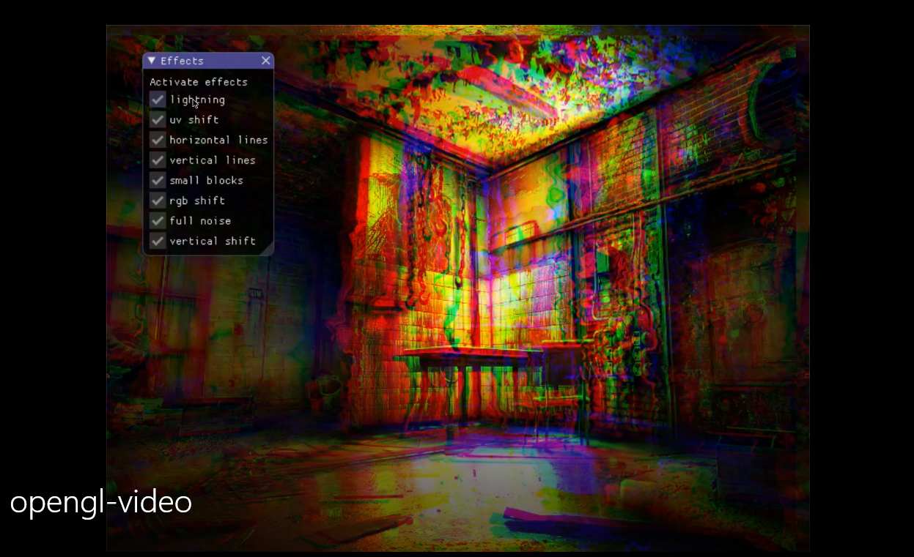

# Glitch effect with OpenGL/C++

A glitch effect using OpenGL/C++. Different effects can be activated with the checkboxes. [A video can be found on this link](https://www.youtube.com/watch?v=3HM03Z7sNzI).

## Screenshot



More examples can be found in the [video](https://www.youtube.com/watch?v=3HM03Z7sNzI).

## Usage

To compile:
```
$ make
```

To load scene:
```
$ ./glitch [path]
```

Examples:
```
$ ./glitch resources/img.jpg
$ ./glitch resources/background.jpg
$ ./glitch resources/tv.jpg
$ ./glitch resources/jigsaw/source/jigsaw.obj
```

ONLY jpg and obj files are accepted!

## Files

* src/main.cc: if file is in .obj format, the class Model is used to render with projection, view and model. If it is a jpg, a rectangle having the image as texture covers the entire screen
* src/shaders: contains all the shaders
* vertex.shd and fragment.shd: used for .obj 3D objects with light
* background_vertex.shd and background_fragment.shd: used for 2D images
